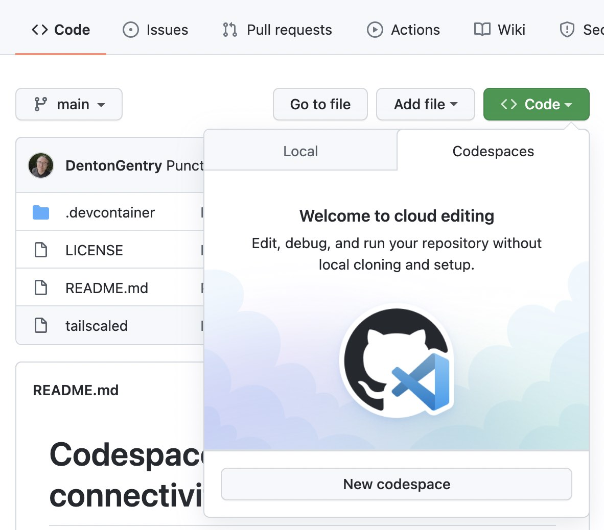

# Codespace feature for Tailscale connectivity

This repository contains a feature for [GitHub Codespaces](https://github.com/features/codespaces)
to connect the running VM to a [Tailscale network](https://tailscale.com).



To get started, add the following [feature](https://docs.github.com/en/codespaces/setting-up-your-project-for-codespaces/adding-features-to-a-devcontainer-file)
to your `devcontainer.json`:

```json
"runArgs": ["--device=/dev/net/tun"],
"features": {
  "ghcr.io/tailscale/codespace/tailscale": {
    "version": "latest"
  }
}
```

Then launch your Codespace. After it starts up, run [`tailscale up`](https://tailscale.com/kb/1080/cli/#up):

```shell
sudo tailscale up --accept-routes
```

You'll only need to run `tailscale up` once per Codespace.
The Tailscale state will be saved between rebuilds.
